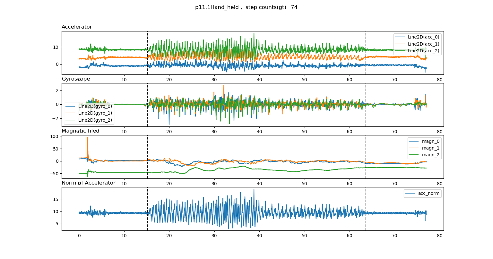
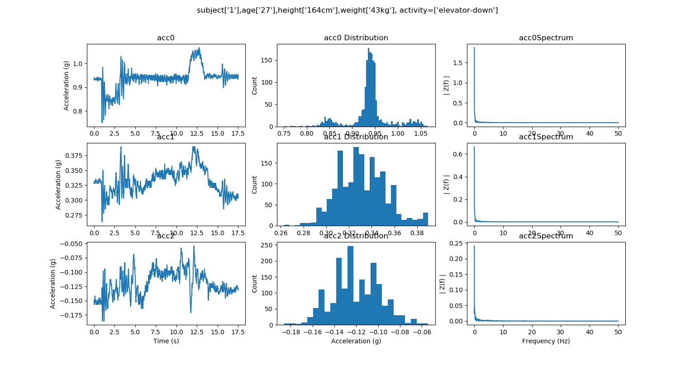
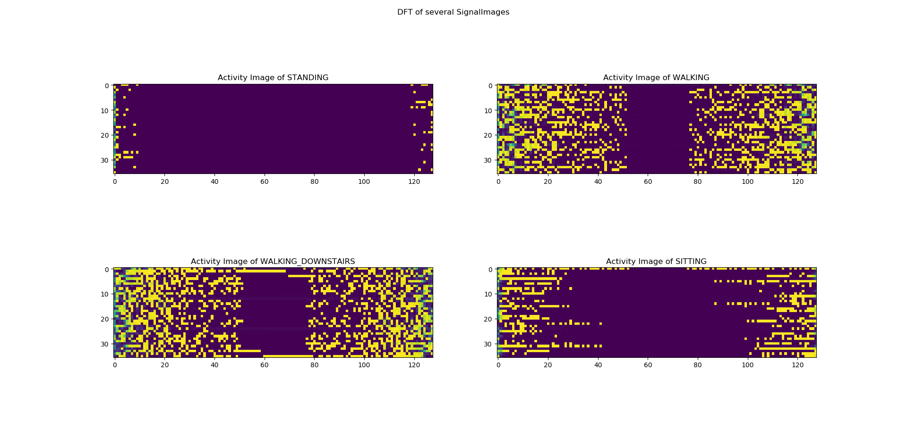

# harX

## What's over here?
 Human activity recognition(HAR) based on sensor data and pedestrian dead reckoning(PDR) in PyTorch.

-[x] dataset readers(You need download raw data and provide the dataset path)
    -[x] [UCI-HAR](https://archive.ics.uci.edu/ml/datasets/human+activity+recognition+using+smartphones)
    -[x] [USC-HAD](http://sipi.usc.edu/had/)
    -[x] [Ubicomp13](https://www.repository.cam.ac.uk/handle/1810/266947)
-[x] models
    -[x] [CNNwithActivityImage](https://archive.ics.uci.edu/ml/datasets/human+activity+recognition+using+smartphones)
    -[x] [CNNLSTM](https://www.mdpi.com/1424-8220/16/1/115)
    -[x] [CNNwithStatistics](https://archive.ics.uci.edu/ml/datasets/human+activity+recognition+using+smartphones)        
    -[x] StackedAutoencoders(not tested!)for [this](https://ieeexplore.ieee.org/abstract/document/8488496)
    -[x] NaivePeakDetector

 ## Background(You can pass this)
 Smart phones are pervasive nowadays and have become important intermediaries of our lives.
 There are many phone sensors, *e.g.*, accelerometers and gyroscopes, generating data almost every second.
 From these raw recordings we can estimate the motion states and further promote some other down-streaming
 tasks such as indoor inertial navigation when GPS are unavailable and healthy cares for the elders living alone.
 
 ## How to use 
 ***Just hack!*** Since I didn't package these stuffs into a python lib, an easy way to use
 these code is to write your own script under `harX` directory. `example1.py` is provided for
 reference and you can run it as easy as:
 ```bash
 cd harX
python example1.py
 ```
You **need** the following packages in your python environment.
```
tqdm             
numpy            
scipy           
torch             
matplotlib
```
 ## Some Results
 You can show the data with some tools in `utils`. 
 
 One sensor data sample coming from [Ubicomp13](https://www.repository.cam.ac.uk/handle/1810/266947)
 
 Check something from another perspective.
 
 
 `ActivityImage` proposed in [Human activity recognition using wearable sensors by deep convolutional neural networks](https://archive.ics.uci.edu/ml/datasets/human+activity+recognition+using+smartphones)
  